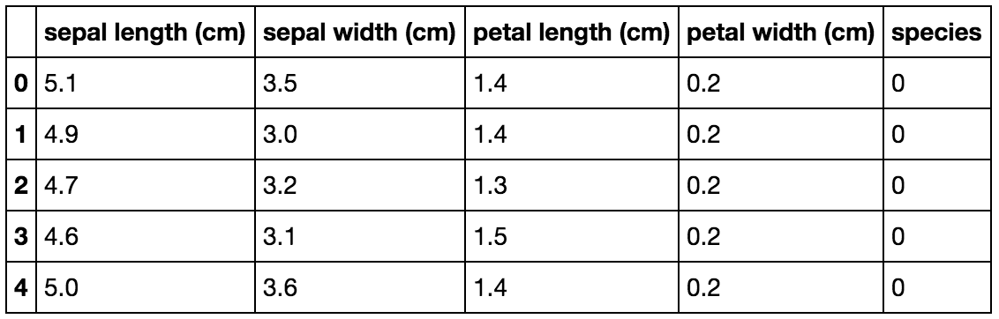

# Lab: Concatenating with Pandas

Scikit Learn is a machine learning library that we'll be using extensively in this course. It has a bunch of [datasets](http://scikit-learn.org/stable/modules/classes.html#module-sklearn.datasets) that come preinstalled. One of them is the [iris dataset](http://scikit-learn.org/stable/modules/generated/sklearn.datasets.load_iris.html), which you've already worked with.

If you look at the Jupyter notebook in this repo, you'll see how the `load_iris()` function works.

A data frame with the species column has already been created using `data.target`.

Your job is twofold:

1. Create a pandas data frame using the values from `data.data`
2. Concatenate that data frame with `target_df`.

Your final data frame should look like the image below:

**BONUS**: Change the values in the `'species'` column from 0, 1, 2 to their corresponding species (Setosa, Versicolor and Virginica).
